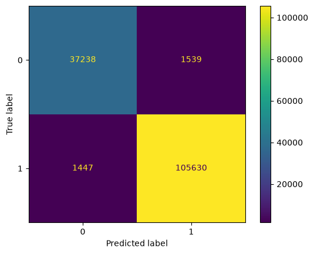

## Cross-Validation
- Select between:
    - ShuffleSplit
    - KFold
    - StratifiedKFold
- Decide on the number of splits for each

6/10/2026:
### k-NN hyperparameters tuning with the following context:
    - preprocessing:
        - dropped: tcprtt, is_ftp_login, dwin
        - one-hot-encoded: state, service, proto
        - scaling: z-score norm
    - hyperparameter search:
        - k = [1,3,7,11,17,21]
- CV accuracy:
```
    Cross-validation accuracy by k (training set):
    k  mean_cv_acc  std_cv_acc
    7     0.994145    0.000310O
    11     0.994131    0.000326
    17     0.993987    0.000350
    21     0.993850    0.000460
    3     0.993514    0.000323
    1     0.991731    0.000541
    Best k: 7
```
- Evaluation on the full training dataset:
```
              precision    recall  f1-score   support

           0       1.00      0.98      0.99     38777
           1       0.99      1.00      1.00    107077

    accuracy                           0.99    145854
   macro avg       0.99      0.99      0.99    145854
weighted avg       0.99      0.99      0.99    145854
```

    


- ### Decision Tree hyperparameter tuning with the following context:
    - preprocessing:
        - dropped: tcprtt, is_ftp_login, dwin
        - one-hot-encoded: state, service, proto
        - scaling: z-score norm
    - hyperparameter search:
        - criterion = gini, entropy
        - minimum split = 1 to 10
- CV accuracy:
```
({'dt__criterion': 'gini', 'dt__min_samples_split': 2},
 np.float64(0.9942408203827066))
```
- Evaluation on the full training dataset:
```
              precision    recall  f1-score   support

           0       0.99      0.99      0.99     38777
           1       1.00      1.00      1.00    107077

    accuracy                           0.99    145854
   macro avg       0.99      0.99      0.99    145854
weighted avg       0.99      0.99      0.99    145854
```


- ### Naive Bayes hyperparameter tuning with the following context:
    - preprocessing:
        - dropped: tcprtt, is_ftp_login, dwin
        - one-hot-encoded: state, service, proto
        - scaling: z-score norm
    - hyperparameter search:
        - var_smoothing = [1e-6, 1e-5, 1e-4, 1e-3, 1e-2, 1e-1, 1]
- CV accuracy:
```
{'nb__var_smoothing': 0.01}
0.9795274781078085
```
- Evaluation on the full training dataset:
```
              precision    recall  f1-score   support

           0       0.96      0.96      0.96     38777
           1       0.99      0.99      0.99    107077

    accuracy                           0.98    145854
   macro avg       0.97      0.97      0.97    145854
weighted avg       0.98      0.98      0.98    145854
```



## Preprocessing adjustments:
- 